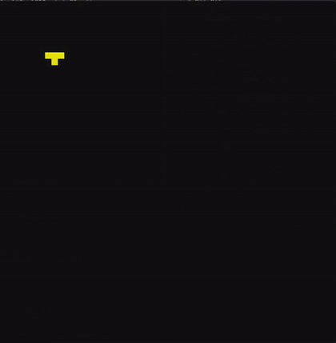

# SlimeGrowth

A cellular-automaton "slime mold" growth sim in C++ using raylib. A single seed cell spreads to random neighboring cells each tick, rendered as a growing yellow blob on a black grid.



## How it works
- 52x52 grid, seeded with one live cell.
- Each frame, every live cell picks a random direction (1-8) and activates that neighbor.
- Grid is redrawn at 8 FPS via raylib.

## Build
Requires raylib.
```
g++ SlimeGrowth.cpp -o SlimeGrowth -lraylib
./SlimeGrowth
```

## Collaboration
Built by **SharmathePeak** and **Vivek** — a quick learning exercise, done fully online over 2 days, ~1hr 40min combined work time.
